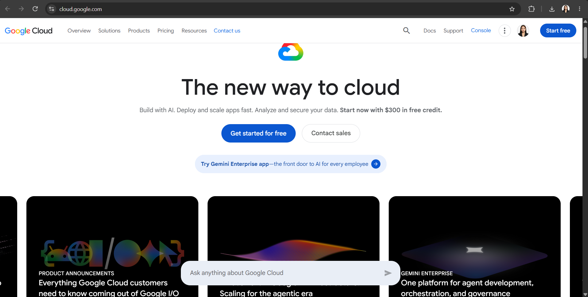

# Google Cloud Platform (GCP) Research

## Brief Overview

Google Cloud Platform (GCP), now commonly called **Google Cloud**, is a cloud computing platform developed by **Google**. It provides cloud services for computing, storage, databases, networking, data analytics, artificial intelligence, and application development. Businesses and developers can use Google's infrastructure to build and run applications without having to manage all the physical hardware themselves.

Google's cloud platform started with **Google App Engine**, which was launched in **April 2008**. It allowed developers to run web applications using Google's infrastructure. Google later expanded its cloud services into what became Google Cloud Platform, offering many different services for businesses and developers.

## Global Infrastructure

Google Cloud has infrastructure in **multiple regions and zones around the world**. Its locations cover **North America, South America, Europe, Asia, the Middle East, and Australia**. A region is a geographic location, while zones are separate locations within a region that help provide better availability and reliability. Google Cloud generally aims to provide at least three zones in each general-purpose region.

Google Cloud is present in many locations, including countries and areas in the **United States, Canada, Brazil, the United Kingdom, Germany, France, Japan, South Korea, India, Singapore, Australia, and other parts of Asia, Europe, and the Middle East**. Users can select regions and zones based on their application's location, performance, and availability requirements.

## Cloud Management Console

The **Google Cloud Console** is the web-based interface used to manage Google Cloud resources and services. Users can create projects, deploy virtual machines, manage storage, work with databases, monitor applications, manage permissions, and view billing information. Services such as Compute Engine and BigQuery can be accessed directly through the console.

## Four (4) Core Services

1. **Compute Engine** — Provides virtual machines that users can create and run on Google's infrastructure. It can be used to host websites, applications, and other workloads.

2. **Cloud Storage** — A scalable cloud storage service used to store files, images, videos, backups, and other types of data.

3. **BigQuery** — A fully managed data warehouse used to analyze very large amounts of data using SQL. It helps businesses find useful information and insights from their data.

4. **Cloud Run** — A fully managed service that allows developers to run applications and containers without managing servers or infrastructure. It can automatically scale applications based on demand.

## Three (3) Advantages

1. **Scalability** — Google Cloud allows businesses to increase or decrease their computing resources depending on their needs.

2. **Strong Data and AI Capabilities** — Google Cloud provides powerful services for data analytics, machine learning, and artificial intelligence, making it useful for companies working with large amounts of data.

3. **Global Infrastructure** — Google Cloud has regions and zones across many parts of the world, allowing businesses to deploy applications closer to their users and improve availability.

## Typical Enterprise Use Cases

GCP is used by **technology companies, financial institutions, retail businesses, healthcare organizations, media companies, startups, and other large enterprises**. Companies use Google Cloud to host websites and applications, store large amounts of data, analyze business information, build AI and machine learning solutions, and run scalable applications.

GCP is especially useful for companies that need **large-scale data processing, analytics, AI, and modern application development**. Google Cloud provides services such as BigQuery, Compute Engine, Cloud Run, and many AI and machine learning tools that can support these business needs.

## Screenshot

